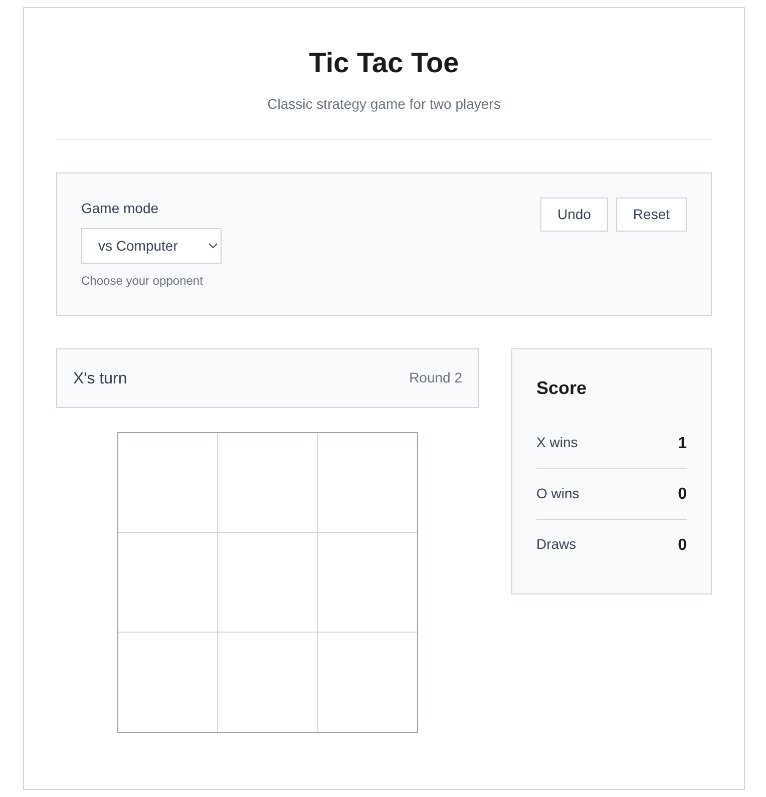

# Vanilla Tic Tac Toe

A clean, minimalistic tic-tac-toe game built with vanilla HTML, CSS, and JavaScript. Features smart AI opponent and responsive design.



## Table of Contents

- [Description](#description)
- [Features](#features)
- [Technologies Used](#technologies-used)
- [Getting Started](#getting-started)
- [Usage](#usage)
- [Game Modes](#game-modes)
- [Deployment](#deployment)
- [Contact](#contact)

## Description

This project is a classic tic-tac-toe game that demonstrates clean, hand-coded web development practices. The application features a smart AI opponent, score tracking across multiple rounds, and a responsive design that works on all devices. Built without any frameworks or build tools - just pure web technologies.

## Features

- **Two Game Modes**: Play against a smart computer AI or challenge a friend locally
- **Intelligent AI**: Computer opponent uses strategic gameplay (win → block → center → corners)
- **Score Tracking**: Keep track of wins, losses, and draws across multiple rounds
- **Undo Functionality**: Take back moves if you make a mistake
- **Responsive Design**: Works seamlessly on desktop, tablet, and mobile devices
- **Clean UI**: Minimalistic, hand-coded design with subtle hover effects
- **Round System**: Play multiple rounds and track overall performance

## Technologies Used

- **HTML** - Semantic markup and structure
- **CSS** - Hand-coded styling with CSS Grid and Flexbox
- **JavaScript (Vanilla)** - Game logic, AI implementation, and DOM manipulation

## Getting Started

To get a local copy up and running follow these simple steps:

### Prerequisites

You need a modern web browser to run this application.

### Installation

1. Clone the repo
   ```bash
   git clone https://github.com/Lushegtech/vanilla-ticktacktoe.git
   ```

2. Navigate to the project directory
   ```bash
   cd vanilla-ticktacktoe
   ```

3. Open the `index.html` file in your web browser, or serve it locally:
   ```bash
   python -m http.server 8000
   # Then visit http://localhost:8000
   ```

## Usage

### Starting a Game

1. **Select Game Mode**: 
   - Choose "vs Computer" to play against the AI
   - Choose "vs Friend" for local two-player mode

2. **Make Your Move**:
   - Click on any empty cell to place your mark (X or O)
   - The game alternates between players automatically

3. **Game Controls**:
   - **Undo**: Take back the last move
   - **Reset**: Start a fresh game
   - **Next Round**: Continue to the next round after a game ends

### Game Modes

#### vs Computer
- You play as X, computer plays as O
- AI uses strategic decision making:
  1. Try to win if possible
  2. Block player from winning
  3. Take center position
  4. Take corner positions
  5. Take any remaining position

#### vs Friend
- Two players take turns on the same device
- X always goes first
- Perfect for local multiplayer gaming

### Scoring System

- Track wins for X, O, and draws
- Scores persist across multiple rounds
- Reset scores by refreshing the page

## Deployment

This project is deployed using GitHub Pages. You can view the live application [here](https://lushegtech.github.io/vanilla-ticktacktoe/).

### Steps to Deploy on GitHub Pages

1. Push your code to GitHub
2. Go to the repository settings
3. In the "Pages" section, select the branch (main) and root directory
4. Save the settings and wait for deployment
5. Your site will be available at `https://lushegtech.github.io/vanilla-ticktacktoe/`

## Contact

**My Name** - Elijah Adebayo

**Email** - olusegunvicky121@gmail.com

**Lushegtech** - [GitHub Profile](https://github.com/Lushegtech)

Project Link: [https://github.com/Lushegtech/vanilla-ticktacktoe](https://github.com/Lushegtech/vanilla-ticktacktoe)

Live Demo: [https://lushegtech.github.io/vanilla-ticktacktoe/](https://lushegtech.github.io/vanilla-ticktacktoe/)

---

*Built with vanilla web technologies. No frameworks, no build process, just clean code that works.*
